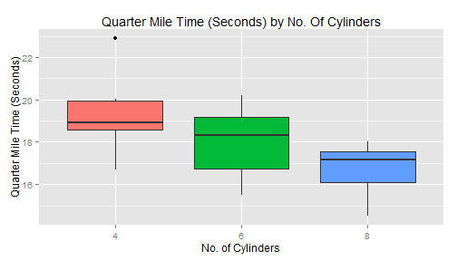

## Introduction

1. What does my app do?
2. Why is it good?
3. How can it be extended?
4. Conclusion

---  

## What does my app do?

* Lets the user select a Factor variable and a Performance Metric
* The chosen variables are plotted as a Box and Whisker diagram in the first tab (example given below)
* The chosen variables are tabulated in the second tab

---

## Why is it good?

* Provides quick, easy, interactive data visualisation
* Gives enhanced detail for more focused analysis
* Utilises a simple, intuitive design

 

---

## How can it be extended?

* Example dataset can be modified to use alternatives for easy customisation
* Additional user input could be added for determining style of graphing
* Several datasets could be added to allow for user choice of which to view

---

## Conclusion

* Great app for allowing user to visualise tables of data
* Simple, intuitive, interactive design
* Solid foundation with many avenues for extension

